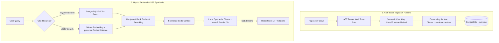

# CodeAtlas — Local-First Semantic Code Search & AI Assistant

CodeAtlas is a privacy-first, 100% local **Retrieval-Augmented Generation (RAG)** platform designed to index, query, and chat with your codebases. 

Unlike cloud-based code search engines, CodeAtlas runs entirely on your local machine using **Docker Compose** and **Ollama**. It parses codebases using Abstract Syntax Trees (AST), indexes chunks into a **pgvector** database, and streams contextual AI answers using local LLMs.

---

## Architecture & Pipeline Flow



---

## Technical Highlights (Engineered for Production)

### 1. Abstract Syntax Tree (AST) Semantic Chunking
Instead of arbitrary character-count line slicing, CodeAtlas uses **Web Tree-Sitter** to parse JavaScript, TypeScript, TSX, Python, Go, and Java source files.
- It identifies logical code constructs (classes, methods, functions) to keep code logic intact within chunks.
- Falls back to a robust overlapping sliding-window chunker for unsupported files.

### 2. Dense Hybrid Retrieval
- **Keyword Matcher:** Full-Text search query matching file paths and contents.
- **Dense Vector Search:** Generates 768-dimension embeddings via local `nomic-embed-text` and queries PostgreSQL using the `pgvector` cosine distance operator (`<=>`).
- Re-ranks and weights vector similarity ($70\%$) and keyword match boosts ($30\%$) to fetch the most relevant context.

### 3. Reactive Streaming Chat
- Implements asynchronous streaming using **Server-Sent Events (SSE)** in NestJS to push tokens in real time.
- Resolved hook closure batching issues in React using `useRef` buffers to guarantee seamless chat history commits and interactive file citations.

---

## 🛠️ Technology Stack

| Component | Technology | Description |
| :--- | :--- | :--- |
| **Frontend** | React, Vite, Vanilla CSS | Sleek glassmorphism UI with responsive sidebar dashboard and streaming chat panel. |
| **Backend** | NestJS, TypeScript, TypeORM | Modular, scalable NestJS architecture with robust background worker queues. |
| **Worker Queue** | BullMQ, Redis | High-performance asynchronous background sync queue for directory crawling and indexing. |
| **Database** | PostgreSQL + pgvector | Persistent database storage for repositories, files, and chunk embeddings. |
| **Local AI** | Ollama | Runs local model inferences and vector embedding generations offline. |
| **AST Parser** | Web Tree-Sitter | Performs syntactic code analysis and code block chunk extraction. |

---

## Getting Started

### Prerequisites
- [Docker & Docker Compose](https://docs.docker.com/engine/install/)
- [Node.js (v18+) & npm](https://nodejs.org/)

### 1. Start Infrastructure (Docker Compose)
Clone the repository and start the database, Redis queue, MinIO storage, and Ollama services:
```bash
docker compose up -d
```

### 2. Pull Local AI Models
Download the vector embedding model and the LLM coder model inside the Ollama container:
```bash
# Pull the 768-dimension text embedding model
docker exec -it codeatlas-ollama ollama pull nomic-embed-text

# Pull the lightweight coder model optimized for CPU execution
docker exec -it codeatlas-ollama ollama pull qwen2.5-coder:3b
```

### 3. Backend Setup
1. Navigate to the backend directory:
   ```bash
   cd backend
   ```
2. Install dependencies:
   ```bash
   npm install
   ```
3. Configure the environment variables (rename `.env.example` to `.env` or use defaults):
   ```env
   DB_HOST=localhost
   DB_PORT=5432
   DB_USER=postgres
   DB_PASSWORD=postgres
   DB_NAME=codeatlas
   REDIS_HOST=localhost
   REDIS_PORT=6379
   OLLAMA_URL=http://localhost:11434
   ```
4. Build and start the backend NestJS application:
   ```bash
   npm run build
   npm run start
   ```

### 4. Frontend Setup
1. Navigate to the frontend directory:
   ```bash
   cd ../frontend
   ```
2. Install dependencies:
   ```bash
   npm install
   ```
3. Run the development server:
   ```bash
   npm run dev
   ```
4. Open your browser and navigate to `http://localhost:5173/`.

---

## Key Lessons & Architectural Decisions

- **Cascade Dissociation Avoidance:** Avoided default TypeORM relation cascades during indexing. Crawlers process files and chunks atomically, querying repo instances without hydrating relations in memory to prevent PostgreSQL foreign key NULL writes.
- **Stale Closure Mitigation:** Avoided state-lag in high-frequency SSE message callbacks by using React `useRef` state buffers, allowing the EventSource stream handler to read updated state synchronously before writing to the React state tree.
- **Zero-Vector Handling:** Handled cosine similarity math errors during network drops by fallback formatting null/NaN similarity returns to standard metrics, avoiding UI-breaking crashes.
