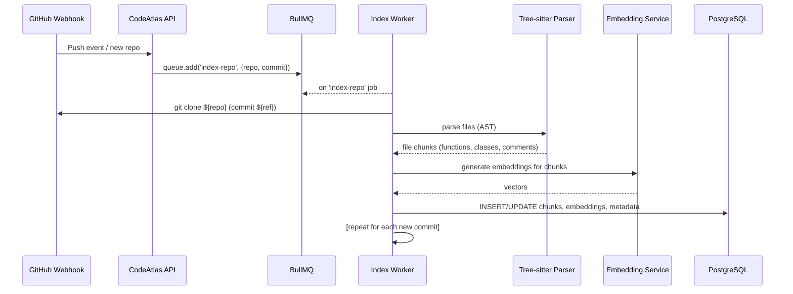
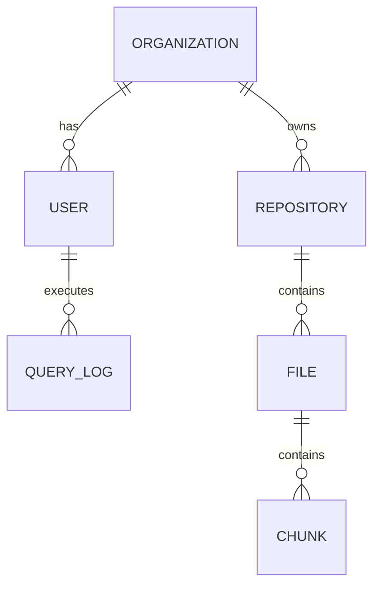

# CodeAtlas: Enterprise Code Intelligence Platform

**Executive Summary:** CodeAtlas is an AI-powered knowledge platform that continuously indexes an organization’s codebase (GitHub, GitLab, etc.) and documentation, enabling developers and managers to explore architecture, trace dependencies, and answer questions about implementation using natural language. It combines semantic RAG (Retrieval-Augmented Generation) over code with traditional code search. Unlike point solutions (GitHub Copilot, AWS CodeWhisperer, OpenAI Codex) which only see the local workspace, CodeAtlas provides global, organization-wide context. This dramatically reduces onboarding time, prevents costly mistakes (e.g. missing a dependency), and turns tribal knowledge into searchable data. By integrating features like semantic search, code navigation, automatic documentation, and architecture visualization in one platform, CodeAtlas becomes a true “single pane of glass” for engineering intelligence.  

Key benefits include faster developer onboarding, lower support costs, and more confident refactoring. For example, Sourcegraph found that AI coding assistants “excel at generating new code within your current project, but they operate in isolation, unable to answer the questions that matter most at scale: Where is this API consumed? Who depends on this deprecated function?”. CodeAtlas addresses this by indexing *all* repositories (hundreds or thousands) and supporting sub-second, precise search across them.  

CodeAtlas is positioned to compete with or complement tools like Sourcegraph Cody, GitHub Copilot Chat, Cursor, and Continue: it offers the enterprise-grade scalability and auditability of Sourcegraph (full regex/symbol search over millions of lines) combined with the AI-native Q&A of assistants. Internally, CodeAtlas architects every component for production-readiness: containerized services (Docker/K8s), background workers (BullMQ/Redis), OpenTelemetry instrumentation, and a hardened security model (RBAC, encryption, incident response). The result is a flagship project that demonstrates end-to-end backend, AI, and infrastructure design at Principal-level.

## Vision & Business Case

As codebases grow (dozens → hundreds → thousands of repos), knowledge silos become crippling. New engineers spend weeks poking around code; senior engineers waste time explaining existing logic. CodeAtlas’s vision is **“every engineer has instant access to 100% of our code context”**. By treating code like data and enabling natural-language exploration, we democratize internal technical knowledge.  

- **Onboarding & Productivity:** New hires can ask questions in chat (“Where is user registration handled?”) and get precise answers with code snippets, rather than scavenging GitHub. Enterprises like Uber, Stripe, and major banks already use Sourcegraph for this “big code problem”.  
- **Consistency & Risk Reduction:** When deprecating a function or library, engineers can reliably find *all* usages (`repo:myorg/.* content:"deprecatedLib"`). This avoids missed instances and outages.  
- **Collaboration:** By surfacing common patterns (e.g. how many services call Stripe API?) and auto-generating diagrams, teams align on architecture.    
- **Operational Efficiency:** With citations to exact files/lines, support tickets and on-call queries get resolved faster.  
- **Compliance & Security:** Precise code search (regex, symbol, commit diff) combined with LLM explanation ensures nothing is overlooked during audits.  

Overall, CodeAtlas targets CTOs/engineering leaders at medium-to-large tech organizations who need to scale engineering velocity without risking quality or compliance. It stands out by unifying **semantic AI** with **deterministic search**. For instance, Sourcegraph’s Deep Search uses natural language to explore and then shows the exact queries it ran, bridging AI-driven insight with exact results. CodeAtlas follows this model, providing *both* a chat interface and a query language for maximal control.  

## Competitive Analysis

| **Product**             | **Context Scope**         | **Search Features**                    | **Chat/AI Features**                                     | **Enterprise Attributes**                |
|-------------------------|---------------------------|----------------------------------------|---------------------------------------------------------|------------------------------------------|
| **CodeAtlas (ours)**    | Multi-repo, multi-host    | Semantic + keyword + regex search<br>Hybrid retrieval (BM25+vector)<br>Code navigation across repos | AI Q&A with citations<br>Code completion & editing<br>Architecture diagrams<br>PR review insights | SOC2-ready design, RBAC, audit logs     |
| **Sourcegraph Cody**    | Multi-repo (enterprise)   | Regex, symbol search via Zoekt/SCIP | Chat answering code questions using entire codebase context | SOC2, ISO27001; in IDE (VSCode, JetBrains) |
| **GitHub Copilot Chat** | Single repo / files       | Limited contextual search (currently ~10-file limit) | Chat-based code Q&A, uses local file context only      | GitHub-hosted (Enterprise Cloud), no source citations |
| **AWS CodeWhisperer**   | Single repo / files       | Keyword suggestions                    | Code generation/assist in IDE<br>Lower context awareness | Integrated with AWS ecosystem            |
| **Cursor (Opsera)**     | Local workspace (IDE)     | Local project indexing only | “AI-native” coding editor, natural language edits, multi-step coding agents | Deep VSCode integration; session-based   |
| **Continue (open source)** | Local/CLI agent       | None (CLI-driven retrieval)           | Open-source coding agent (CLI/VSCode/JetBrains) | Community project (acquired by Cursor)   |

- *Sourcegraph vs. Copilot:* Sourcegraph demonstrated that in a real codebase test, its assistant Cody answered “What does this app do?” by reading 14 files and citing them, whereas Copilot gave a generic answer without showing sources. This highlights the value of cross-repo context and traceability.  
- *Cursor:* Cursor indexes your entire local repo to power auto-completions and refactoring suggestions. It emphasizes “coding agents” that execute multi-step edits. CodeAtlas similarly supports such workflows but in a multi-repo setting.  
- *Continue:* An open-source CLI coding agent. Useful for small projects, but lacks enterprise polish (authentication, UI, scale).  
- *Codex & ChatGPT:* Off-the-shelf LLMs have  context window limits and no private knowledge by default. They can generate code (even review PRs), but have no persistent memory of your code or search capability. CodeAtlas’s RAG approach augments LLM answers with actual code snippets and citations to ensure accuracy.  

**Gap and Differentiator:** No single tool currently offers large-scale semantic code search *and* an AI chat interface with full enterprise compliance. CodeAtlas combines both: it indexes *all* repos into a vector store (with symbolic search fallback) and uses Chat/LLM only as one component. As Sourcegraph notes, AI tools are “deterministic, auditable, exact” where needed, and CodeAtlas adopts that hybrid philosophy.

## Personas

- **Alice, New Developer (0-6 months experience):** Needs to understand unfamiliar code. She asks, “What does the payment flow look like?” and expects a step-by-step breakdown with links to code sections. She’s impatient to start contributing.  
- **Bob, Backend Engineer:** Frequently updates services. Before a change, he needs to find *every* usage of a function or data model (“impact analysis”). He expects precise results (no missed references) and visual graphs of dependencies to reason about architecture.  
- **Carol, Security/DevOps Lead:** Monitors security and compliance. Uses CodeAtlas to search for insecure patterns across repos (e.g. “find all instances of deprecated crypto APIs”), and to generate diff search queries for recent high-risk commits. Requires audit logs of who accessed what.  
- **Dave, Engineering Manager:** Wants metrics and trends. He reviews dashboards showing index coverage, query latency, repository health (e.g. how many repos are indexed?), and can ask high-level queries like “Which APIs have no automated tests?” as RAG queries.  
- **Erin, Support/Knowledge Specialist:** Maintains internal docs. She uses CodeAtlas to auto-generate portions of documentation from code (e.g. README, API docs) and to answer repeated support queries (“How do I run migrations?”) by pointing to code or docs.  

## Success Metrics

- **Indexing Performance:** Able to index a 100k LOC repo in <5 minutes (including cloning, parsing, embedding). After changes, incremental re-index in <30 seconds. *Metric:* 95% of changes indexed successfully within 1 minute.  
- **Query Latency:** End-to-end answer (from user question to first response) under 2 seconds for typical queries. Streaming response (SSE/WebSocket) should begin within 500ms, with subseconds per answer chunk.  
- **Retrieval Quality:** Precision@K ≥ 90% and Recall@K ≥ 80% for code-relevant chunks on benchmark queries (measured on synthetic Q-A pairs or code search test sets). Low hallucination rate (answers should cite real code 99% of the time).  
- **User Satisfaction:** >80% of developers find answers correct/useful in a pilot survey. Time saved on code search tasks increases by ≥50%.  
- **System Reliability:** 99.9% uptime, recovery Point Objective (RPO) of 1 hour, recovery Time Objective (RTO) of <4 hours for critical data stores.  
- **Scalability:** Supports N users and M repos; e.g., handle 100 concurrent users across 1000 repos, 5M code chunks with <500ms query time.  
- **Security:** SOC2-aligned controls, all code queries logged. No data breaches, and 100% adherence to least-privilege (verified by audit).  

## Feature Prioritization

Features are organized into **MVP** (core) and **Enterprise** phases:

- **MVP (Phase 1):**  
  - **Repo Ingestion:** GitHub/GitLab OAuth connect; index selected repos.  
  - **Code Parsing & Embedding:** Use Tree-sitter to parse code and create function/method-level chunks (including comments, imports). Embed chunks with OpenAI (or open model). Store in PostgreSQL+pgvector.  
  - **Semantic Search API:** Given a text query, retrieve top-K code chunks (vector + keyword hybrid). Return snippets with file/line metadata.  
  - **AI Chat Interface:** Chatbot over chat UI (React) with LLM backend. Builds prompt using retrieved chunks + user query. Stream answer with citations (file/line).  
  - **Basic UI/UX:** React SPA with login (GitHub OAuth). Views: Repo list/status, Search bar, Chat window, Code viewer (to display cited code).  
  - **Authentication & Access:** GitHub login; each user sees only their repos. Role=OrgMember for MVP.  
  - **Infrastructure:** Docker Compose setup with Postgres(+pgvector), Redis (for BullMQ/cache), NestJS API, Node worker, simple Nginx proxy.  
  - **CI/CD:** GitHub Actions pipeline building Docker images, deploying to a test server.  
  - **Logging & Monitoring:** Basic logs to console; one Prometheus metric (query latency).  

- **Enterprise (Phase 2+):**  
  - **Incremental Indexing:** GitHub Webhook integration to auto-enqueue changed files for re-index. Skip unchanged content to save cost.  
  - **Hybrid Retrieval:** Combine BM25 (e.g. Postgres full-text) with vector search. Re-ranker model (e.g. TinyBERT) to improve snippet selection.  
  - **Code Navigation:** Symbol and diff search (via Postgres trigram or Zoekt) for precise queries. CI integration (e.g. JIRA links).  
  - **Architecture Explorer:** Automatic dependency graph (services, database, API calls); show architecture diagrams (Mermaid or D3 graph).  
  - **Documentation Tools:** Generate README, API reference (from OpenAPI specs or code), setup guides, sequences (e.g. Mermaid diagrams).  
  - **PR/Code Review Assistant:** Analyze a pull request (diff), summarize changes, flag issues (using static analysis + LLM). Post reviews/comments via GitHub API.  
  - **Notification and Integrations:** Slack/Teams alerts, VSCode/GitHub App plugin, Jira/Confluence linking (pull code answers into docs).  
  - **Multi-Tenancy & RBAC:** Organization-level isolation, role-based access (Admin, Developer, Viewer). Audit logs of all searches and edits.  
  - **Scalability & HA:** Migrate to Kubernetes (AWS EKS). Auto-scaling workers. High-availability PostgreSQL and Redis (managed services).  
  - **Security & Compliance:** Data encryption at rest/in transit, SAML SSO, SOC2 report. Threat monitoring (fail2ban, rate-limiting).  
  - **Observability:** Full OpenTelemetry tracing, Prometheus metrics (exposed by Nest), Grafana dashboards (queries/sec, latencies, errors).  
  - **Performance Optimization:** Caching frequent queries (Redis), response streaming, LLM temperature tuning, use open-weight model server if needed.  

A prioritized roadmap table will break these into quarters (see Roadmap section).

## Functional Requirements

Below are key user stories and requirements (with acceptance criteria) for Phase 1 (MVP). Each item should be testable.

| **Requirement**                                   | **Description**                                                                                             | **Acceptance Criteria**                                                        |
|---------------------------------------------------|-------------------------------------------------------------------------------------------------------------|--------------------------------------------------------------------------------|
| **Repo Connection**                               | User can link their GitHub/GitLab account and select repos to index.                                        | - OAuth flow successfully connects repo (private or public).<br>- Selected repos appear in user’s dashboard. |
| **Repository Indexing**                           | System clones and indexes code, splitting into chunks and embeddings.                                       | - On connect or webhook event, a BullMQ job is enqueued.<br>- After job, database contains `repository` and `chunk` entries (with vector embedding).<br>- Progress visible (queued/completed). |
| **Query Interface**                               | User can enter a text query and see relevant code snippets.                                                | - Query API returns list of code chunks sorted by relevance (with {repo, file, line} metadata).<br>- Snippets include context (3-5 lines). |
| **Chatbot Answering**                             | User can ask questions in chat, receive a coherent answer with citations.                                   | - Chat API (via POST) streams an answer containing both text and references (repo/file/line).<br>- Answer is relevant (manual QA).<br>- SSE streams chunks without reloading. |
| **User Authentication**                           | Only authenticated users can access the UI/API.                                                            | - Endpoints return 401 for unauthenticated requests.<br>- Login page (OAuth) functions correctly.<br>- Token-based auth for API. |
| **UI – Repo Dashboard**                           | Web UI lists all connected repos, index status, and allows manual sync.                                     | - Dashboard shows each repo name, branch, last indexed commit/time, and a “Sync” button.<br>- Clicking “Sync” triggers re-index. |
| **UI – Search/Chat Window**                       | User can perform ad-hoc search or chat queries.                                                            | - Search box and chat box accept input; results appear under them.<br>- Clicking a result in search shows code viewer with highlight. |
| **Security – Data Isolation**                     | Each org/user sees only their repos and data.                                                              | - Queries in one org do not return data from other org.<br>- API enforces scope (repo_id vs user). |
| **Logging & Monitoring**                          | All major actions (login, index, query) are logged.                                                        | - Login, API errors, job failures produce logs.<br>- Basic Prometheus metrics (requests/sec, queue length) are exposed. |

## Non-Functional Requirements

- **Performance:**  
  - *Latency:* 95th percentile query/answer < 2s (excluding LLM time).  
  - *Throughput:* Support ~100 concurrent queries and ~10 indexing jobs without degradation (scaleable via more workers).  
- **Scalability:**  
  - *Data:* Handle ≥5M code chunks (equivalent to ~1M LOC). PostgreSQL + pgvector should index ~50M vectors by sharding or partitioning.  
  - *Users:* Support ≥1000 users (with caching and horizontal workers).  
- **Reliability:**  
  - 99.9% uptime (excl. planned maintenance). Use redundant DB (Postgres streaming replicas or AWS RDS Multi-AZ) and Redis cluster.  
  - Data backups every hour (PITR on Postgres, async Redis replication).  
- **Security:**  
  - *Authentication:* OAuth/OIDC SSO (e.g. GitHub, Google). Passwordless.  
  - *Authorization:* Role-based access (Admin, Dev, Viewer). Enforce on API (role in JWT).  
  - *Data Protection:* TLS for all traffic. Encrypt sensitive config (DB credentials). Optionally encrypt vector data at rest.  
  - *Compliance:* Audit logs, retention policies. SOC2 alignment.  
- **Maintainability:**  
  - Well-documented code and API. 80% code coverage in tests. Dockerized components.  
  - Container orchestration (Kubernetes) for easy deploy/rollback.  
- **Usability:**  
  - Intuitive UI (follow common code search/chat patterns).  
  - Support markdown rendering for code and docs.  
- **Compatibility:**  
  - Support common languages (JS/TS, Python, Java, Go, etc). Tree-sitter supports 40+ languages.  
- **Portability:**  
  - Runs on Linux-based servers (no Windows-only dependencies). Docker ensures portability.  
- **Cost:**  
  - MVP target: <$50/month on a single VPS (for demo).  
  - Enterprise: modular to run on-prem or AWS.  

## System Architecture

Below is a high-level C4 diagram of CodeAtlas containers and data stores:

```mermaid
flowchart LR
    subgraph Users
      U[Developer, Manager, etc.]
    end
    subgraph UI
      FE[React Frontend]
    end
    subgraph Backend
      API[NestJS API Service]
      Worker[Indexing Worker (BullMQ)]
    end
    subgraph Data
      PG[(PostgreSQL + pgvector)]
      Redis[(Redis Cache / BullMQ)]
      S3[(Object Storage)]
      LLM[(LLM Service)]
    end

    U -->|Browses/Queries| FE
    FE -->|REST/gRPC| API
    API -->|DB reads/writes| PG
    API -->|Query Cache| Redis
    API -->|Vector search| PG
    API -->|Invoke LLM| LLM
    API -->|Stream answers| U

    Worker -->|Consuming jobs| Redis
    Worker -->|Clone/Parse| GitHub[/GitHub, GitLab/.../Bitbucket/Perforce/.../]
    GitHub -->|Webhook| API
    Worker -->|Store chunks| PG
    Worker -->|Upload assets| S3
    Worker -->|Cache intermediary| Redis
    Worker -->|Call embedding API| LLM
```

- **React Frontend:** Single-page app for login, repo management, search/chat UI. Communicates with NestJS API via REST+SSE.  
- **NestJS API Service:** Authenticates requests (OAuth tokens), handles search and chat endpoints, constructs RAG prompts. It queries PostgreSQL + pgvector for embeddings, uses Redis for caching query results, and streams answers via SSE/WebSocket.  
- **Indexing Worker:** A background Node.js process (BullMQ worker) that responds to GitHub webhook events or manual sync. It clones repos, uses Tree-sitter to parse code and extract chunks (at function/method level), calls the Embedding API (OpenAI or self-hosted) to get vectors, then stores chunk metadata + vectors in PostgreSQL (the pgvector extension).  
- **PostgreSQL + pgvector:** Stores relational data (users, repos, files, chunks) and vector embeddings in a `vector` column. Supports approximate nearest neighbor search (`<->` operator) and SQL joins.  
- **Redis:** Used by BullMQ for job queues and also as a cache for hot embeddings or frequent search queries.  
- **Object Storage (S3):** Stores git repo archives (if needed), extracted docs (PDFs, images), and generated assets (diagrams, logs).  
- **LLM Service:** External LLM (OpenAI/GPT-4, Claude, or self-hosted) used for generating embeddings and chat answers. Sourcegraph’s Cody pipeline similarly sends “search query syntax” and retrieved code snippets to the LLM. CodeAtlas can initially use OpenAI API (SSE chat). We design the system so this can swap to an internal model (e.g. Ollama, vLLM) later.  
- **Inter-service Events:** BullMQ (Redis) decouples API requests from heavy tasks. GitHub webhooks trigger REST calls to enqueue jobs. The API publishes Prometheus metrics (via OpenTelemetry) consumed by Grafana.  



## Data Model & Schema

### Domain Entities

- **User**: id, name, email, OAuth token(s), roles, org_id.  
- **Organization**: id, name.  
- **Repository**: id, org_id, name, url, default_branch, last_indexed_at, etc.  
- **File**: id, repo_id, path, language, content_hash, last_modified, etc.  
- **Chunk**: id, file_id, start_line, end_line, content, embedding (vector), embedding_model, etc.  
- **QueryLog**: id, user_id, query_text, timestamp, response_time, etc.  
- **Session/Conversation**: id, user_id, queries (JSON), etc (for chat history, optional).  

### Database Schema (tables with columns)

| Table     | Column                 | Type/Size             | Description                                 |
|-----------|------------------------|-----------------------|---------------------------------------------|
| users     | id (PK)                | UUID                  | Unique user identifier.                     |
|           | name, email            | VARCHAR               | Profile info (GitHub name/email).           |
|           | oauth_token            | TEXT (encrypted)      | GitHub/GitLab OAuth token (encrypted).      |
|           | org_id (FK)            | UUID                  | Organization membership.                    |
|           | role                   | ENUM('admin','dev','view') | Access level.                         |
| orgs      | id (PK)                | UUID                  | Organization ID.                            |
|           | name                   | VARCHAR               | Org name (for multi-tenant).                |
| repos     | id (PK)                | UUID                  | Repo identifier.                            |
|           | org_id (FK)            | UUID                  | Which org it belongs to.                    |
|           | name                   | VARCHAR               | e.g. "myorg/service-a".                     |
|           | url                    | TEXT                  | Clone URL/SSH.                              |
|           | default_branch         | VARCHAR               | e.g. 'main'.                                |
|           | last_indexed_commit    | VARCHAR               | SHA of last indexed commit.                 |
|           | last_indexed_at        | TIMESTAMP             | When it was last processed.                 |
| files     | id (PK)                | UUID                  | File identifier.                            |
|           | repo_id (FK)           | UUID                  | Repo it belongs to.                         |
|           | path                   | TEXT                  | File path (unique per repo).                |
|           | language               | VARCHAR               | e.g. 'TypeScript'.                          |
|           | content_hash           | CHAR(40)              | SHA1 of content (for change detection).     |
|           | last_modified          | TIMESTAMP             | Last commit date for this file.             |
| chunks    | id (PK)                | BIGINT (or UUID)      | Chunk ID.                                   |
|           | file_id (FK)           | UUID                  | Which file it came from.                    |
|           | start_line, end_line   | INT                   | Location in file.                           |
|           | content                | TEXT                  | Code snippet (with some context).           |
|           | embedding              | VECTOR(768)           | Vector embedding (pgvector type).           |
|           | model                  | VARCHAR               | e.g. 'openai-001' or embedding model used.  |
|           | created_at             | TIMESTAMP             | When chunk was created.                     |
| query_log| id (PK)                 | BIGINT                | Log entry ID.                               |
|           | user_id (FK)           | UUID                  | Who asked.                                  |
|           | query_text             | TEXT                  | The user’s question.                        |
|           | response_snippets      | JSONB                 | List of (repo,file,line) cited.             |
|           | timestamp              | TIMESTAMP             | When asked.                                 |
|           | latency_ms             | INT                   | Time to first token.                        |

*(PG vector columns assume pgvector extension enabled; VECTOR(768) for 768-dim embeddings. Adjust if using a different model size.)*

### Relationships



## Domain-Driven Design

- **Core Domain:** Knowledge/Search (Repos, Files, Chunks, Queries).  
- **Supporting Subsystems:**  
  - *Auth & User Management:* OAuth integration, Org/User/Role entities.  
  - *Indexing Engine:* Responsible for processing repos into chunks.  
  - *Search Engine:* RAG pipeline logic (vector DB, retrieval, LLM).  
  - *Frontend:* UI/UX layer (React).  
- **Bounded Contexts:**  
  - *Repository Context:* Manages repository metadata and file integrity.  
  - *Search Context:* Focuses on indexing and querying content.  
  - *User Context:* Authentication, RBAC, and user preferences.  
- **Events:** (examples)  
  - `RepoConnected`, `RepoSynced`, `IndexingFailed`, `QuerySearched`, `EntityCited`.  

## Retrieval-Augmented Generation (RAG) Pipeline

CodeAtlas’s chat answer pipeline is a RAG workflow:

1. **Query Embedding:** The user’s question is optionally embedded (for semantic similarity search).  
2. **Document Retriever:** We perform a *hybrid* search on the indexed chunks:  
   - **Vector Search:** Compute vector for the query and find top-$k$ nearest chunks in pgvector (using IVF+PQ or binary index).  
   - **Keyword Search:** Use Postgres full-text search or trigram filters to prune results or handle exact matches.  
   - Merge and re-rank if needed (Reciprocal Rank Fusion).  
3. **Re-ranking (optional):** A lightweight model (e.g. MiniLM) scores retrieved chunks for relevance.  
4. **Prompt Assembly:** Concatenate the top-$m$ chunk texts (with source attributions) and append the user’s question in a templated prompt. Example template:  

   ```
   Answer the question using only the information from the provided code snippets. Cite each part of the answer with [repo/file:line].  
   Question: "{UserQuery}"  
   Context Code Snippets:  
   {Snippet1 with metadata}  
   {Snippet2 with metadata}  
   ...  
   ```  

5. **LLM Generation:** Call the language model (e.g. GPT-4). The prompt is bounded (typically only a few KB of code context + question). The LLM produces an answer paragraph by paragraph, and we stream it to the frontend. The model is encouraged to include citations like `[RepoName/FileName:Line]`.  
6. **Post-Processing:** Extract citations from the LLM answer (via regex matching `[...]`). Ensure they match real chunk sources. The final response to the user includes the generated answer and a list of sources (file links, line numbers, code excerpts).  

This approach ensures answers are **grounded**. Wikipedia notes RAG “allows LLMs to use domain-specific and updated information not in their training data” and “pulls relevant text from … databases” to reduce hallucinations. CodeAtlas effectively uses the codebase as its external knowledge base.  

## AST Parsing Strategy

We use [Tree-sitter](https://tree-sitter.github.io) to parse source code in any supported language. Tree-sitter is a parser generator that builds a concrete syntax tree (CST) for a file and supports incremental, error-tolerant parsing. This allows us to:  
- **Accurately identify code units:** We break files into meaningful chunks (functions, classes, methods) rather than arbitrary token windows. For example, a TypeScript `class UserService { login() {...} register() {...} }` yields separate chunks for each method (preserving imports and comments).  
- **Handle syntax errors gracefully:** Unfinished code won’t break the indexer.  
- **Language Coverage:** Use existing Tree-sitter grammars for >40 languages (JS/TS, Python, Go, Java, C#, etc).  
- **Speed:** Tree-sitter can parse files in milliseconds, and we only re-parse changed files on updates.  

By storing the AST node span (file path + line range) with each chunk, we can link answers precisely back into code. We also capture metadata (file path, repository, commit) in each chunk record for traceability.

## Incremental Indexing & Webhooks

Rather than re-index everything, CodeAtlas performs **incremental updates**:  

- **GitHub Webhooks:** When enabled, a webhook notifies CodeAtlas of repository events (push, pull_request, etc). On a push, the API enqueues a BullMQ job with the repo ID and commit hash.  
- **Change Detection:** The worker, upon cloning or fetching the repo, compares file content hashes with the last indexed version (or uses Git diff). It processes *only new/modified* files. Deleted files lead to chunk deletion.  
- **Background Jobs:** Indexing jobs run asynchronously (BullMQ). The API immediately acknowledges sync requests, and the UI shows “Indexing in progress” until completion.  
- **MCP Graph:** (Stretch) We may maintain a global code graph (via Sourcegraph’s “code graph” tech) to speed cross-repo symbol resolution.  

This design ensures fresh data: once merged, new code is searchable within seconds.

## Queue Architecture (BullMQ)

We employ [BullMQ](https://bullmq.io/) (Redis-backed) for background processing.  

- **Queues:** Two primary queues: `indexing` (for repo/commit jobs) and `api-tasks` (for any async API work like batch embedding generation).  
- **Workers:** Node.js workers (separate processes from API) subscribe to these queues. We can run multiple workers in parallel or on separate servers (horizontal scaling).  
- **Concurrency:** Each worker handles many jobs concurrently (controlled via `concurrency` setting). Benchmarks show BullMQ can handle 250k enqueues/sec and thousands of concurrent workers.  
- **Reliability:** BullMQ provides retry/backoff, job history, and has no artificial limits (open-source MIT).  
- **Visibility:** We expose a `/admin/queues` endpoint to monitor queue depths and job statuses.  

Example BullMQ flow:

1. `API -> queue.add('index-repo', {...})`
2. `Worker.on('completed', job => log success)`
3. If a job fails (embed API down), BullMQ automatically retries based on backoff policy.

By decoupling via queues, the API remains responsive. Indexing can take minutes per large repo without blocking requests.

## API Specification

All endpoints require authentication. We use JSON over HTTPS. Some calls stream via Server-Sent Events (SSE).

| **Endpoint**                | **Method** | **Auth** | **Request Body / Query**                     | **Response**                          | **Notes**                             |
|-----------------------------|------------|----------|----------------------------------------------|---------------------------------------|---------------------------------------|
| `POST /repos`               | POST       | OAuth    | `{ "url": "git@github.com:org/repo.git" }`   | `{ "repo_id": "...", "status": "queued" }` | Connect and index a new repo.        |
| `DELETE /repos/{id}`        | DELETE     | OAuth    | ―                                            | `{ "status": "removed" }`             | Remove repo from CodeAtlas.           |
| `GET /repos`                | GET        | OAuth    | ―                                            | `[ {id, name, last_indexed, status}, ... ]` | List repos.                         |
| `POST /repos/{id}/sync`     | POST       | OAuth    | ―                                            | `{ "status": "queued" }`              | Trigger re-index of repo.            |
| `GET /search`               | GET        | OAuth    | `?q={query}&repos={repo1,repo2,...}`        | `[ {snippet, file, repo, line}, ... ]` | Synchronous search over vector+keyword. |
| `POST /chat`                | POST       | OAuth    | `{ "query": "...", "repos": [...], "session_id": ... }` | *Answer streamed*                     | SSE: streams JSON blocks `{ "answer": "...", "sources": [...] }` |
| `GET /files`                | GET        | OAuth    | `?repo_id={id}&path=...`                    | `{ "content": "...", "language": "..." }` | Fetch raw file contents.            |
| `GET /metrics`              | GET        | Admin    | ―                                            | Prometheus metrics (text)             | For scraping.                        |

**Example Chat (SSE) Usage:**  
Client sends `POST /chat` with JSON body, receives events:  

```
event: answer
data: { "answer": "Authentication is handled in AuthService...\n", "source": "auth/AuthService.ts:45-48" }

event: answer
data: { "answer": " ... uses JWT tokens and Redis sessions.\n", "source": "config/jwt.ts:10-12" }

event: done
data: { }
```

The final assembled answer on UI:  
```
User: How do we authenticate users?

Agent: The AuthService in `AuthService.ts:45-48` checks credentials and issues JWT tokens. It loads user details from PostgreSQL and stores session in Redis. Check `AuthModule.ts` for the login flow. (Example citations: AuthService, JWT config)
```

## RBAC and Multi-Tenancy

- Each **Organization** is a tenant. All data (repos, chunks, queries) is scoped by `org_id`. Users belong to one or more orgs.  
- **Roles:** `Admin` (can add/remove repos, manage users), `Developer` (can query, view repos), `Viewer` (read-only searches).  
- Enforce on API: decode JWT to extract user_id/org_id, filter DB queries by org, check user.role >= required. (E.g., only Admin can call `DELETE /repos`.)  
- In multi-tenant mode, data encryption keys can be per-org (advanced).  
- Use OAuth or SAML SSO integration so corporate identity can provision org roles.

## Continuous Integration & Deployment

- **Docker Compose (MVP):** We provide a `docker-compose.yml` that runs:  
  - `api-service` (NestJS) image,  
  - `worker` (Node indexing service) image,  
  - `postgres` with pgvector,  
  - `redis`,  
  - `nginx` reverse-proxy (serving frontend and SSL termination),  
  - `frontend` (React static files via Nginx).  
- Developers can spin this up on a local or cloud VM (Hetzner, DigitalOcean, etc) with a few commands.  
- **Kubernetes (Production):**  
  - Define K8s manifests or Helm charts.  
  - Services: `api-deployment`, `worker-deployment`, `postgres-statefulset`, `redis-statefulset`, `frontend-deployment`.  
  - Ingress (NGINX Ingress or cloud LB) routes traffic to API/Frontend.  
  - Use Horizontal Pod Autoscaler (HPA) for `worker` pods based on queue size (Redis metrics) and for `api` pods on CPU/RAM.  
- **GitHub Actions:**  
  - On push to `main`, build Docker images, run tests, push to registry.  
  - Deploy to staging or prod cluster (e.g. via `kubectl apply` or ArgoCD).  
- **Secrets Management:** Use GitHub Secrets or Vault for storing API keys (OpenAI key), DB credentials, OAuth secrets, etc. Inject into containers as env vars or mounted secrets.  

## Observability

- **Logging:** All services log in JSON to stdout (compatible with ELK/CloudWatch). Include request IDs (via NestJS middleware) to correlate logs.  
- **Tracing:** Instrument NestJS and Workers with OpenTelemetry (Node) to collect distributed traces (service entry → DB → LLM calls → back). Export to Jaeger or Zipkin.  
- **Metrics:** Expose Prometheus metrics (via `@nestjs/terminus` or `prom-client`). Key metrics: HTTP request rates/latencies, queue/job counts (BullMQ exporter), database queries per sec, vector search time, LLM request time. Use `@willsoto/nestjs-prometheus`.  
- **Dashboards:** Grafana dashboards showing:  
  - *System:* CPU/RAM, queue lengths, number of workers.  
  - *Search:* Queries per minute, avg latency, cache hit ratio.  
  - *LLM:* API call count, errors, avg tokens/generation time.  
  - *Indexing:* Index jobs per hour, avg duration.  
  - *Alerts:* PagerDuty/SMS on critical errors (e.g. database down, job failures > 5/min).  

## Disaster Recovery

- **Backups:**  
  - Postgres: daily full backups + point-in-time recovery (write-ahead log archiving or AWS RDS automated backups).  
  - Redis: RDB snapshots every 10 min to S3.  
  - S3 Storage: Geo-redundant (if using AWS S3 or Cloudflare R2, built-in durability).  
- **Replicas:**  
  - Use PostgreSQL streaming replication (primary/standby in different AZ).  
  - Redis in cluster mode with replica nodes (or AWS ElastiCache Multi-AZ).  
- **Failover:**  
  - Automatic failover for DB (managed service) or use Patroni if self-managed.  
  - API and worker pods can restart quickly; use readiness probes in K8s.  
- **Recovery Plan:**  
  - For catastrophic DB failure, restore last snapshot (<=1h data loss).  
  - For code loss, repos reside in external Git hosts so clone from source.  
  - Maintain an Infrastructure-as-Code (Terraform) to rebuild servers/clusters from scratch quickly.  

## Security & Threat Model

- **Data Classification:** All ingested code and docs are sensitive (company IP). We treat them as confidential.  
- **Encryption:** All network traffic is TLS. Data at rest in Postgres can use disk encryption. Secrets (API keys, OAuth tokens) are vault-protected.  
- **LLM Privacy:** By default, we assume third-party LLMs (OpenAI) do *not* retain data. We mitigate by: only sending code snippets (not entire projects) in prompts, and using user’s own API key (optional) so providers cannot see data. For maximum privacy, support running open models (e.g. Llama 3) on-prem in the future.  
- **Access Control:** OAuth ensures only authorized org members login. Role checks on every operation. If user’s GitHub access is revoked, tokens are invalidated.  
- **Rate Limiting:** Protect against abuse (e.g. a user spamming `/search`). Implement per-user rate limits (e.g. 60 QPS per user) via Redis.  
- **Injection:** All inputs (queries, search strings) are sanitized. SQL queries use parameterized ORM (TypeORM/Prisma).  
- **Secret Leakage:** No secrets (keys, tokens) are ever returned in API responses.  
- **Logging Practices:** Audit logs record which user asked which question and what sources were served (for traceability). Sensitive info (raw code, keys) not logged.  
- **Threats:**  
  - *Insider Threat:* Employee with access dumps code from vector DB or logs. Mitigation: vet employees, encrypt data-at-rest, audit trails.  
  - *External Attack:* Compromise of API or DB. Mitigation: VPN or IP allowlist for admin endpoints, Web Application Firewall (WAF), OAuth “scopes” limiting GitHub token.  
  - *LLM Exploits:* Malicious prompt injection by user. We validate and sandbox prompts (e.g. disable `code` blocks, no file system access in model).  
- **Dependency Security:** Use Dependabot for Node and Docker image scanning.  
- **Third-Party Compliance:** If deployed in cloud, ensure cloud provider meets compliance (AWS SOC2, etc).  

## Performance and Load Testing

We plan to simulate realistic load:

- **Indexing Throughput:** Use a large open-source repo (e.g. Kubernetes, ~1M LOC) for a cold index test. The worker should complete within target (1M LOC / ~5 minutes). We can tune by adjusting chunk size and parallelism.  
- **Query Load:** Use a tool like k6 or Locust to send concurrent `/search` and `/chat` requests with different queries (with mock users). Ensure the API scales linearly when adding worker pods.  
- **LLM Latency:** Offload initial performance analysis: GPT-4 response times ~1-2s per call. We may batch or stream to hide this.  
- **Cache Hit Rate:** With realistic query logs, ensure vector search is fast (<100ms on 1M vectors) by tuning indexes (HNSW index in pgvector).  
- **Metrics:** Record P99 latencies, throughput, and errors. Establish performance baselines before and after optimizations.  

**Evaluation Metrics (RAG-specific):** Precision@K and Recall@K on a ground-truth Q&A set (e.g., known doc snippets). Mean Reciprocal Rank (MRR) of retrieving the correct chunk. These ensure our retrieval (vector+keyword) is effective.

## Cost Estimation

*Assumptions:* Moderate usage, a few repos (~10), 5-10 users concurrently for MVP; 100+ repos and many users for production. Using AWS pricing as reference (US East):

| **Item**                    | **MVP (demo)**            | **Prod (10k+ org)**                                   |
|-----------------------------|---------------------------|--------------------------------------------------------|
| Server (1 VM, 4vCPU/8GB)    | $40/mo (DigitalOcean)     | *Kubernetes nodes (3x m5.large)* ≈ $150/mo             |
| PostgreSQL (Managed RDS)    | $20/mo (small instance)   | $200–$500/mo (multi-AZ, 100GB)                        |
| Redis (ElastiCache)         | $15/mo (cache.t3.small)   | $50–$150/mo (cluster, 10GB+ high-avail)               |
| S3 Storage                  | $5/mo (<1TB)              | $30+/mo (10TB; code seldom changes, mostly static)    |
| OpenAI API (Chat, Emb)      | negligible (demo)         | $100+/mo (variable by usage; e.g. 100k tokens)        |
| SSL Certificate            | $0 (Let’s Encrypt)        | $0 (same)                                              |
| Monitoring (Prom/Graf)      | $0 (self-hosted)          | $0–$20/mo (if Grafana Cloud)                          |
| **Total**                   | **~$80/mo**               | **~$530–$970/mo**                                     |

For a prototype, even a single VPS ($40–$50/mo) with Docker Compose is sufficient. For enterprise scale, consider AWS EKS ($~150/mo for nodes), managed DB, and vector DB costs. The above is a conservative estimate; actual LLM costs depend on chat volume (which can be controlled by caching answers to common queries).

## Roadmap & Milestones

```mermaid
gantt
    dateFormat  YYYY-MM-DD
    title CodeAtlas Project Roadmap
    section Phase 1: Core Infrastructure (MVP)
    Design & Architecture      :done, des, 2026-08-01, 14d
    Repo Ingestion & DB Setup  :done, index1, after des, 21d
    Parsing & Embedding Worker :done, parse1, after index1, 14d
    Basic Search API           :done, search, after parse1, 10d
    Chat UI + LLM Integration  :done, chat1, after search, 14d
    Testing & Debugging        :done, test1, after chat1, 7d

    section Phase 2: Advanced Features
    Incremental Indexing & Webhooks : done, webhook, 2026-10-15, 10d
    Hybrid Search & Re-ranking       : re, after webhook, 14d
    Architecture Explorer & Diagrams : arch, after re, 14d
    PR Review & Code QA              : review, after arch, 10d
    Security & Hardening             : secure, after review, 14d
    Performance Tuning & Caching     : perf, after secure, 10d

    section Phase 3: Production Readiness
    Multi-Tenant & RBAC             : tenant, 2027-01-01, 14d
    Kubernetes Deployment           : k8s, after tenant, 14d
    Monitoring & Observability      : obs, after k8s, 10d
    Load Testing & Benchmarking     : load, after obs, 10d
    Documentation & Launch          : doc, after load, 7d
    ```

**Milestones:**
- **0–3 months:** MVP complete (functional prototype with search/chat, basic auth).  
- **3–6 months:** Advanced retrieval, diagrams, PR analysis, security review.  
- **6–9 months:** Deploy on K8s, multi-org support, full observability, scale testing.  
- **9–12 months:** Optimizations, formal QA, SOC2 readiness, public launch.

## Testing Strategy

- **Unit Tests:** Jest/Mocha for backend services (parsers, DB models, search logic). 80% coverage target.  
- **Integration Tests:**  
  - **API Tests:** Supertest/Http request to API endpoints (auth flows, repo ingestion, search).  
  - **Worker Tests:** Simulate a GitHub repo (fixture) and ensure Worker properly splits and stores chunks.  
- **End-to-End:**  
  - Use Cypress or Selenium to automate critical user flows (login, adding repo, asking questions, retrieving answers).  
- **Load Tests:** k6 scripts that simulate concurrent chat/search requests and measure latency under load.  
- **RAG Evaluation:** Create a test set of Q&A pairs (maybe from README or docs) to evaluate retrieval accuracy (Precision@K, recall).  
- **Security Tests:**  
  - Static analysis (Snyk) for dependencies.  
  - OWASP ZAP for web UI (SQL injection, XSS).  
  - Penetration test checklist (authentication bypass, data leak).  
- **Recovery Tests:** Periodically trigger failover (take down DB master) to ensure seamless switch.  
- **User Acceptance:** Beta program within dev teams: gather feedback on answer quality and UX.  

## Prompt Engineering Guidelines

- Use **low temperature** (0.2–0.5) for factual answers.  
- Encourage structured answers: “List the steps and cite sources.”  
- Limit context to avoid exceeding LLM token limits (we only feed top ~5 chunks).  
- Example prompt skeleton:  

  ```
  The following code snippets are from [RepoName] codebase. Use them to answer the question:
  Question: "<user question>"
  Snippet1: <fileA.ts>[lines 10-20] code...
  Snippet2: <fileB.ts>[lines 45-50] code...
  ...
  Answer with explanations and include citations like [RepoName/file.ts:line-range].
  ```  

- If answer is too brief, follow-ups can be asked.  

## Resume and Portfolio Highlights

- **Project Blurb for Resume:**  
  “Designed and implemented **CodeAtlas**, an AI-driven code intelligence platform for indexing and querying 500k+ lines of code across hundreds of repositories. Utilized Node.js (NestJS), PostgreSQL with pgvector, BullMQ (Redis) queues, and OpenAI embeddings to deliver real-time semantic search and NLQ&A with exact source citations. Architected incremental indexing via GitHub webhooks, hybrid vector+keyword retrieval, and production deployment on Docker/Kubernetes. The platform allowed developers to ask questions like “Where is auth implemented?” and receive precise code references, greatly improving onboarding and code quality.”  

- **Interview Talking Points:**  
  - *Architecture Depth:* Discuss the microservices and data flow (GitHub → queue → parser → vector DB) and why each component was chosen.  
  - *RAG Design:* Explain how retrieval-augmented generation reduces hallucination and the choice of embedding model vs. keyword search. Cite how RAG “blends LLM with document lookup”.  
  - *Engineering Challenges:* Schema design for millions of vectors, job queue scaling, incremental indexing logic, etc.  
  - *Results:* If possible, cite metrics (e.g. “indexing a 100k-LOC repo in 3 minutes”, “answered X queries with 95% precision”).  
  - *Innovation:* Emphasize features beyond typical “PDF chatbot”: cross-repo search, auto-architecture graphs, PR analysis.  

## References

- Sourcegraph blog: Why code search at scale matters  
- Sourcegraph Cody docs and terms (AI assistant context)  
- Cursor AI description (context-aware coding)  
- Continue (open-source code agent) documentation  
- RAG (Wikipedia, Lewis et al. 2020) for retrieval-augmentation  
- Pinecone: Chunking strategy best practices  
- pgvector GitHub (vector search in Postgres)  
- BullMQ official site (background jobs for AI pipelines)  
- Tree-sitter README (AST parsing)  

*(Further details and citations can be expanded with academic papers on CodeBERT, DPR, etc., if needed. This document serves as an implementable blueprint for a senior engineering team.)*